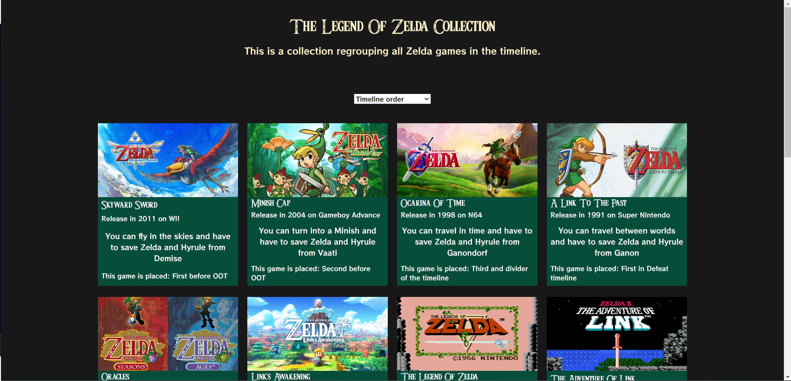

# Zelda Collection

The goal of this project will be to summarize our current knowledge of :

* HTML and CSS
* Responsive design
* Javascript Basics
* The DOM

to create a collection of items.

## Screenshots

## Badges

## work progress

This project was made in September 2023 during a formation at BeCode.

